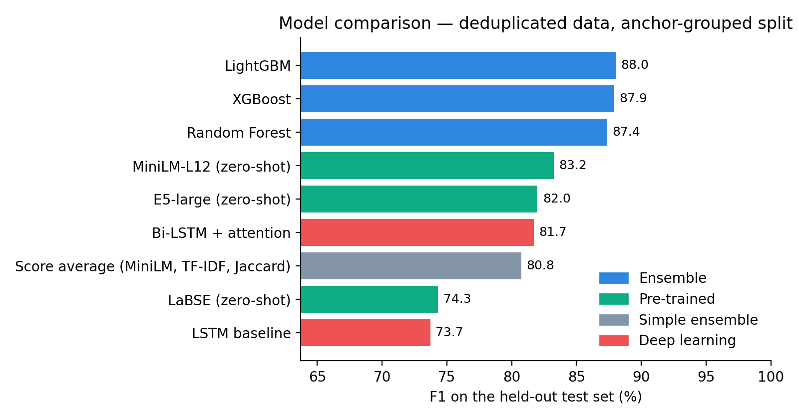
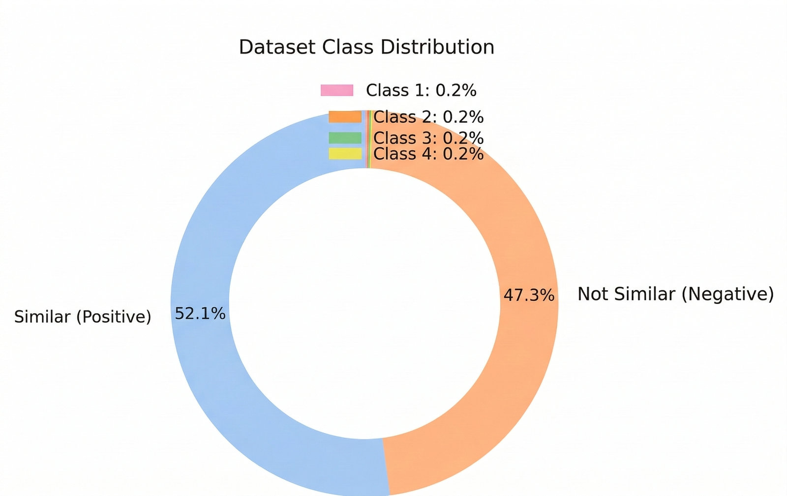
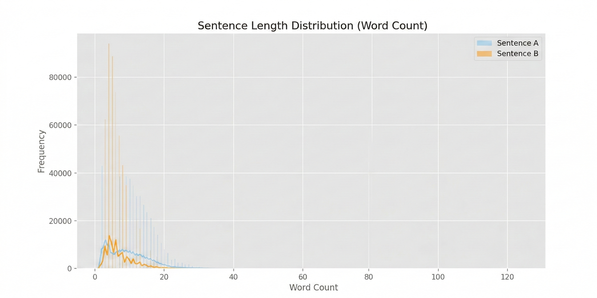
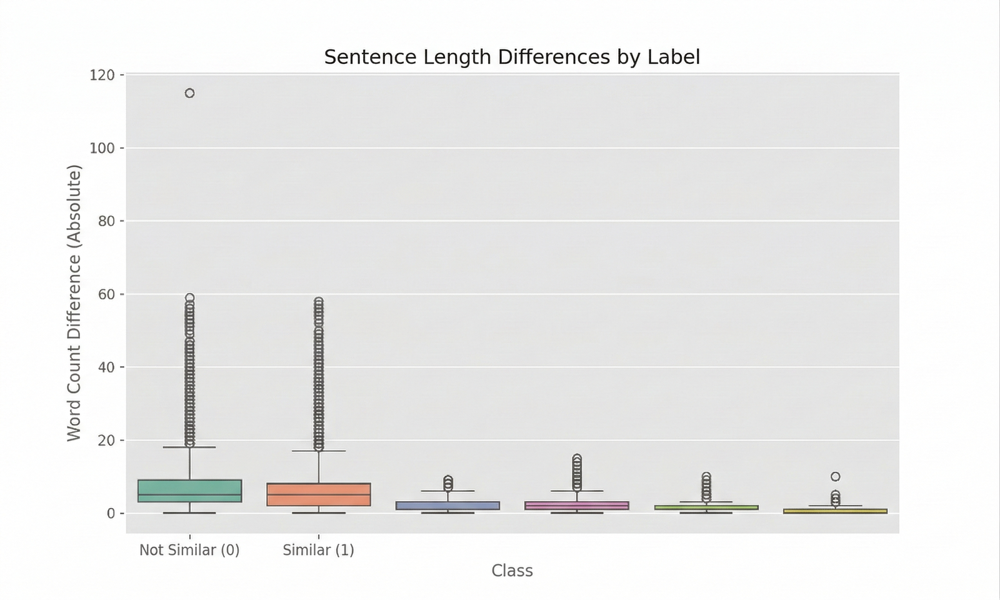
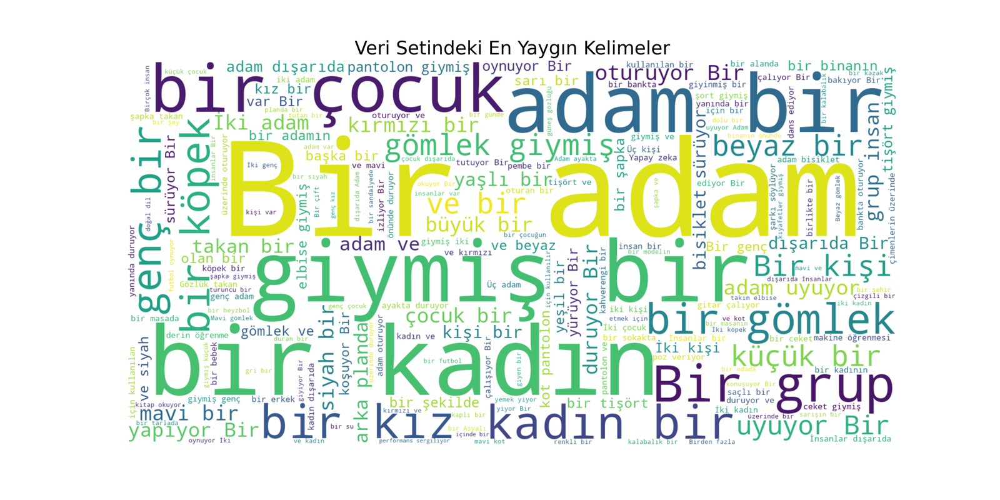
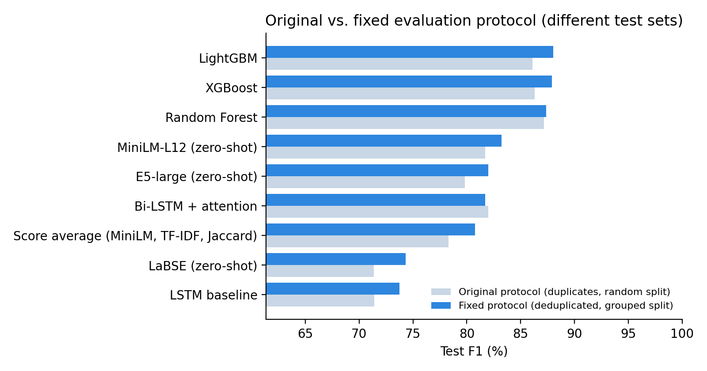
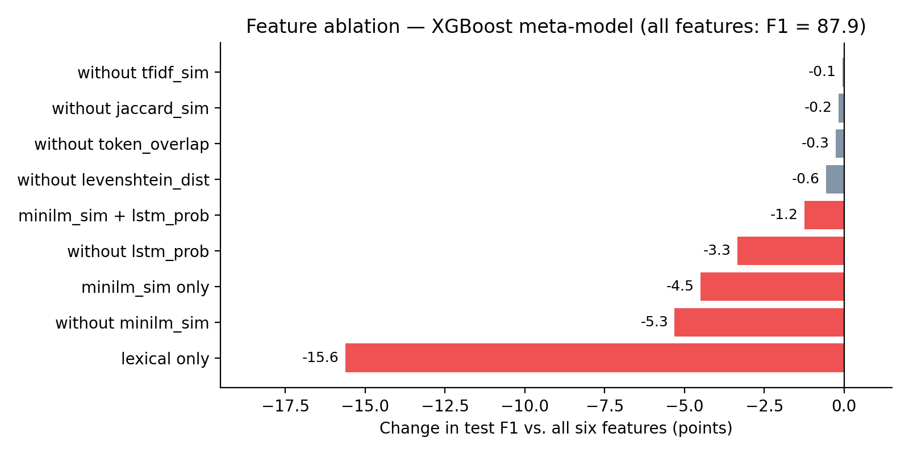
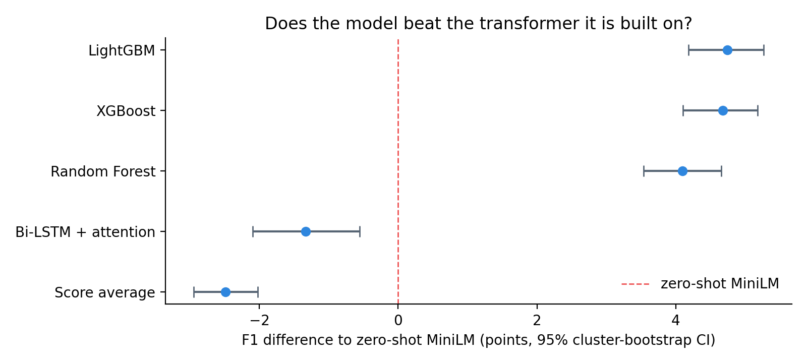

# Turkish Paraphrase Detection — Hybrid Ensemble


[](https://github.com/BurakYildizGameDev/turkish-sts-ensemble/actions/workflows/tests.yml)

Decides whether two **Turkish** sentences mean the same thing. A multilingual transformer (MiniLM), a Siamese Bi-LSTM and four lexical similarity features are stacked into a tree ensemble (Random Forest / XGBoost / LightGBM).

On a deduplicated 62K-pair sample with an **anchor-grouped** train/test split, the ensemble reaches **F1 = 0.880** (LightGBM). Zero-shot MiniLM alone reaches **0.832**. The +4.7 point gain is significant: the 95% cluster-bootstrap interval is [+4.2, +5.3].

<p align="center">
  
</p>

---

## How it works

```
 sentence A ─┐
             ├─► MiniLM-L12 (multilingual)  ──► cosine similarity ─────┐
 sentence B ─┤                                                         │
             ├─► Siamese Bi-LSTM            ──► P(paraphrase) ─────────┤
             │                                                         ├─► RF / XGBoost / LightGBM ─► 0 / 1
             └─► lexical features           ──► TF-IDF cosine          │
                                                Jaccard                │
                                                token overlap          │
                                                Levenshtein distance ──┘
```

| Feature | What it captures |
|---|---|
| `minilm_sim` | Cosine similarity of [`paraphrase-multilingual-MiniLM-L12-v2`](https://huggingface.co/sentence-transformers/paraphrase-multilingual-MiniLM-L12-v2) embeddings (zero-shot) |
| `lstm_prob` | Output of a Siamese Bi-LSTM with attention, trained from scratch (PyTorch) |
| `tfidf_sim` | Cosine similarity of TF-IDF vectors (5,000 features, fit on training text only) |
| `jaccard_sim` | Word-set intersection over union |
| `token_overlap` | Number of shared lower-cased tokens |
| `levenshtein_dist` | Character-level edit distance |

## Dataset

There is no large, human-labelled Turkish paraphrase corpus. This project therefore merges three public Hugging Face datasets that come from very different places: machine-translated NLI data, a synthetic machine-learning corpus, and the machine-translated STS Benchmark. Each is turned into binary *same meaning / different meaning* pairs.

```
Hugging Face ──► scripts/build_dataset.py ──► 620,089 pairs ──► sts.data.deduplicate ──► 326,279 unique pairs
                 (download, label, merge)     (raw, with duplicates)  (drop duplicates + 62 conflicts)
                                                                               │
                                                  random sample of 62,000 ◄────┘
                                                               │
                                     anchor-grouped 80/20 split: 49,617 train / 12,383 test
```

### Sources

#### 1. `mertcobanov/all-nli-triplets-turkish` — translated NLI triplets

| | |
|---|---|
| Link | https://huggingface.co/datasets/mertcobanov/all-nli-triplets-turkish |
| Origin | Turkish machine translation of [`sentence-transformers/all-nli`](https://huggingface.co/datasets/sentence-transformers/all-nli), which combines **SNLI** (Bowman et al., 2015) and **MultiNLI** (Williams et al., 2018) |
| Translation | "A state-of-the-art machine translation model" (the dataset card does not name it), with quality checks for semantic consistency. The English originals are kept in separate columns. |
| Size | 277,386 train / 6,584 dev / 6,609 test triplets. **Only the train split is used.** |
| Columns | `anchor`, `positive`, `negative` and their `*_translated` counterparts |
| License | Follows the terms of `sentence-transformers/all-nli`: SNLI is CC BY-SA 4.0, and MultiNLI has per-genre licenses (see its data description). |
| Label rule | (anchor, positive) → 1 and (anchor, negative) → 0, using the Turkish columns |

Each triplet is a premise (`anchor`), a hypothesis the premise **entails** (`positive`), and a hypothesis it **contradicts** (`negative`). SNLI premises are Flickr30k image captions. MultiNLI premises come from written and spoken genres such as fiction, government reports, travel guides and telephone conversations.

This source is by far the largest, but it is not true paraphrase data. An entailed hypothesis is usually a shorter, more general restatement: on average the anchor has 10.4 words and the hypothesis 5.8. "Kostümlü insanlar sokakta yürüyor" entails "İnsanlar dışarıdalar", but the two sentences do not mean exactly the same thing. The negatives are contradictions that often share most of their words with the anchor, which makes this the hardest source.

Each anchor appears in about three triplets, so the same (anchor, positive) pair occurs several times. **52.9% of the rows from this source are exact duplicates.** This is the main reason for the deduplication and the anchor-grouped split.

#### 2. `dogukanvzr/ml-paraphrase-tr` — machine-learning paraphrases

| | |
|---|---|
| Link | https://huggingface.co/datasets/dogukanvzr/ml-paraphrase-tr |
| Origin | Turkish sentences about machine-learning education topics: neural networks, deep learning, clustering, NLP and similar (Veziroğlu, 2025) |
| Construction | The card does not document how the positive pairs were produced. **Negatives were created by random mismatching**, i.e. two unrelated sentences from the corpus. |
| Size | 60,000 pairs: 45,000 positive (75%) and 15,000 negative |
| Columns | `sentence1`, `sentence2`, `label` |
| License | Apache 2.0 |
| Label rule | Labels used as provided |

The sentences are long (≈12.5 words) and technical. Because the negatives are random pairs of unrelated sentences, they are easy to reject: even zero-shot MiniLM reaches 0.97 F1 on this source (see [Per-source results](#per-source-results)). A handful of pairs (≈0.2%) have an English sentence on one side.

#### 3. `figenfikri/stsb_tr` — Turkish STS Benchmark

| | |
|---|---|
| Link | https://huggingface.co/datasets/figenfikri/stsb_tr |
| Origin | Turkish translation of the **STS Benchmark** (Cer et al., 2017), produced with the Google Cloud Translation API by Beken Fikri, Oflazer and Yanıkoğlu (GEM 2021) |
| Size | 5,749 train / 1,500 validation / 1,379 test pairs. **Only the train split is used.** |
| Columns | `sentence1`, `sentence2`, `score` (0–5), `genre` (news, captions, forums), `dataset`, `year`, `sid` |
| License | Not stated on the dataset card. The English STS Benchmark is distributed for research use. |
| Label rule | score ≥ 3.0 → 1, otherwise 0. The median score is exactly 3.0, which gives 52% positives. |

STS-B is the only source with **graded human similarity judgements**. A score of 3 means "roughly equivalent, but some important information differs". The binary threshold therefore sits on a fuzzy boundary, and pairs just above and below it are hard even for people. `scripts/build_dataset.py` keeps the original score in the `original_score` column, and `data/processed/semantic_dataset.csv` keeps the 0–5 scores unbinarised.

#### Considered but not used

[`nezahatkorkmaz/turkce-embedding-sts-degerlendirme`](https://huggingface.co/datasets/nezahatkorkmaz/turkce-embedding-sts-degerlendirme) (Apache 2.0) contains 200 text pairs with 0–1 similarity scores, generated with the `suayptalha/Sungur-9B` language model. The first version of the project used it for manual spot checks. It is not part of the training or test data, because it is small, synthetic and continuously scored.

### Statistics

Numbers after deduplication, from [`results/dataset_stats.csv`](results/dataset_stats.csv) (`python scripts/dataset_stats.py`):

| Source | Raw pairs | Unique pairs | Duplicates | Positive | Unique anchors | Words (A / B) | Chars / sentence |
|---|---:|---:|---:|---:|---:|---:|---:|
| NLI triplets | 554,340 | 260,840 | 52.9% | 50.4% | 93,810 | 10.4 / 5.8 | 54 |
| ML paraphrase | 60,000 | 59,772 | 0.4% | 74.9% | 40,064 | 12.7 / 12.3 | 104 |
| STS-B (tr) | 5,749 | 5,667 | 1.4% | 52.1% | 5,372 | 8.3 / 8.3 | 61 |
| **Total** | **620,089** | **326,279** | **47.4%** | **54.9%** | **139,142** | 10.8 / 7.1 | 63 |

<sub>Raw pairs exclude 432 rows with an empty sentence. Duplicates are matched after lower-casing and whitespace normalisation, in either sentence order.</sub>

### Examples

| Source | Sentence A | Sentence B | Label |
|---|---|---|:---:|
| NLI | Bir grup insan maraton koşuyor. | İnsanlar koşuyor. | 1 |
| NLI | Bir kadın penceresinin dışındaki bir ipte çorap asıyor. | Çorap asan bir kadın. | 1 |
| NLI | Bir duvar ustası beton düzleştiriyor. | Bir duvar ustası betona delik açıyor. | 0 |
| NLI | İki adam kaykay sürüyor ve bunlardan biri bir zıplama numarası yapıyor. | İki adam odalarında takılıyor. | 0 |
| ML | MSE, bir tahmin modelinin doğruluğunu ölçmek için kullanılan önemli bir metriktir. | MSE, tahmin modelinin ne kadar doğru olduğunu belirlemek için kullanılır. | 1 |
| ML | Bu algoritma, ağırlıkların hata sinyalini azaltmak için iteratif bir şekilde ayarlanır. | Tıp, finans ve ulaşım gibi farklı sektörlerde yapay zeka uygulanmaktadır. | 0 |
| STS-B | Bir adam bıçak kullanarak hızla mantar kesiyor. | Bir kişi mantarları bıçakla hızla kesiyor. | 1 (3.75) |
| STS-B | Bir defne tayı, annesinin yanında çimenli bir alanda yürüyor. | Daha büyük bir atın yanında yürüyen genç atın yakından görünümü. | 0 (2.6) |
| STS-B | Bir kadın brokoli pişiriyor. | Bir adam yemeğini yiyor. | 0 (0.5) |

### Preprocessing

1. **Download and label.** `scripts/build_dataset.py` pulls the three train splits from Hugging Face, applies the label rules above, and writes `data/processed/semantic_dataset_binary.csv`. Each row has `text_a`, `text_b`, `label_value`, `source` and `original_score`.
2. **Clean.** `sts.data.load_pairs` drops rows with an empty sentence. The text itself is not modified: no stemming, stop-word removal or diacritic folding.
3. **Deduplicate.** `sts.data.deduplicate` builds an order-independent key from the lower-cased, whitespace-normalised pair. It drops every copy after the first, and removes pairs whose copies disagree on the label (62 pairs).
4. **Sample.** A random 62,000-pair sample (seed 42) keeps training time to a few minutes on a laptop GPU.
5. **Split.** `GroupShuffleSplit` groups pairs by their normalised anchor sentence (`text_a`), so an anchor and all its hypotheses land on the same side.

<details>
<summary>Data exploration plots</summary>

| | |
|---|---|
|  |  |
|  |  |

</details>

## Evaluation protocol

The first version of this project evaluated on a random split of the raw rows. About 23% of the test pairs were also in the training set, and 63% of the test anchors had been seen in training. The stacking features were computed in-sample as well. The current protocol fixes all of this:

| | Original | Current |
|---|---|---|
| Data | raw rows, duplicates included | duplicates and label conflicts removed |
| Split | random 80/20 | 80/20 **grouped by anchor sentence** |
| Test pairs also in training | 23.2% | **0%** |
| Test anchors seen in training (in any role) | 63.1% | 6.1% |
| `lstm_prob` for training rows | predicted by a model trained on those rows | **out-of-fold** (5 anchor-grouped folds) |
| TF-IDF vocabulary | fit on train + test | fit on train only |
| Zero-shot thresholds | tuned on the evaluation data | tuned on the training set |
| Meta-model for the demo | — | chosen by cross-validation on the training set |

Sample size is 62,000 pairs in both cases: 49.6K for training and 12.4K for testing.

## Results

### Model comparison (held-out test set, 12,383 pairs)

| Model | Type | Accuracy | Precision | Recall | F1 | AUC |
|---|---|---:|---:|---:|---:|---:|
| **LightGBM** | Ensemble | **0.867** | 0.864 | 0.897 | **0.880** | **0.940** |
| XGBoost | Ensemble | 0.866 | 0.864 | 0.895 | 0.879 | 0.940 |
| Random Forest | Ensemble | 0.859 | 0.856 | 0.893 | 0.874 | 0.932 |
| MiniLM-L12 (zero-shot) | Pre-trained | 0.806 | 0.787 | 0.883 | 0.832 | 0.891 |
| E5-large (zero-shot) | Pre-trained | 0.793 | 0.782 | 0.862 | 0.820 | 0.875 |
| Bi-LSTM + attention | Deep learning | 0.794 | 0.794 | 0.842 | 0.817 | 0.879 |
| Score average (MiniLM, TF-IDF, Jaccard) | Simple ensemble | 0.767 | 0.734 | 0.897 | 0.808 | 0.841 |
| LaBSE (zero-shot) | Pre-trained | 0.665 | 0.639 | 0.888 | 0.743 | 0.763 |
| LSTM baseline | Deep learning | 0.698 | 0.701 | 0.778 | 0.737 | 0.752 |

The larger multilingual encoders do not beat MiniLM zero-shot, which is the only one of the three trained for paraphrase identification. A hand-weighted score average is worse than MiniLM alone. The gain comes from the learned meta-model.

### Per-source results

The same test set, split by the source of each pair (`python src/per_source.py`, [`results/per_source.csv`](results/per_source.csv)):

| Source | Test pairs | Positive | MiniLM F1 | Ensemble F1 | Δ | Ensemble AUC |
|---|---:|---:|---:|---:|---:|---:|
| NLI triplets | 9,833 | 49.8% | 0.786 | **0.848** | **+6.2** | 0.922 |
| ML paraphrase | 2,325 | 75.0% | 0.972 | 0.977 | +0.5 | 0.989 |
| STS-B (tr) | 225 | 53.8% | **0.816** | 0.793 | −2.4 | 0.848 |
| All | 12,383 | 54.6% | 0.832 | 0.880 | +4.7 | 0.940 |

- **NLI is where the ensemble earns its keep.** Contradictions that reuse the anchor's words fool a single similarity score. The Bi-LSTM, trained on this kind of pair, learns to catch them.
- **ML paraphrase is nearly solved** by any semantic model, because its negatives are random, unrelated sentences.
- **STS-B is the weak spot.** The meta-model is fit mostly on NLI pairs and does not transfer to graded, news- and forum-style similarity, where MiniLM alone is better. With only 225 test pairs this difference is not reliable, but it is a clear hint that the model is tuned to the dominant source.

### Did the leakage inflate the original numbers?

No. The same code run with the original protocol (`--protocol legacy`) gives Random Forest F1 = 0.872, which reproduces the 0.871 reported by the first version. The fixed protocol gives 0.874–0.880. The two runs use different test sets, and the deduplicated data has a slightly higher positive rate (54.6% vs 52.2%), which makes F1 a little easier. The comparison therefore shows that the leak did not inflate the scores. It does not show that the fixed protocol is harder.

<p align="center"></p>

### Ablation

Each feature is removed in turn. The XGBoost meta-model is retrained on the training split and scored on the test split.

<p align="center"></p>

- Removing `minilm_sim` costs **−5.3 F1**, and removing `lstm_prob` costs **−3.3**. Both carry signal the other lacks.
- The four lexical features add about 1.2 points together (MiniLM + LSTM alone: 86.7), and 0.1–0.6 points each.
- Lexical features alone reach only 72.3.

Train-set cross-validation F1 for every configuration is in [`results/ablation.csv`](results/ablation.csv).

### Is the gain over MiniLM real?

Test pairs that share an anchor are not independent, so the bootstrap resamples whole anchor groups (1,000 resamples, 9,545 groups). Each model is compared with MiniLM on the same resamples.

<p align="center"></p>

| Model | F1 | 95% CI | Δ vs MiniLM | 95% CI of Δ |
|---|---:|---|---:|---|
| LightGBM | 0.880 | [0.872, 0.886] | +4.7 | [+4.2, +5.3] |
| XGBoost | 0.879 | [0.872, 0.886] | +4.7 | [+4.1, +5.2] |
| Random Forest | 0.873 | [0.866, 0.880] | +4.1 | [+3.5, +4.7] |
| MiniLM-L12 (zero-shot) | 0.832 | [0.825, 0.840] | — | — |
| Bi-LSTM + attention | 0.819 | [0.812, 0.826] | −1.3 | [−2.1, −0.6] |
| Score average | 0.808 | [0.800, 0.815] | −2.5 | [−3.0, −2.0] |

<sub>In this table the Bi-LSTM threshold is tuned on the training set, so its F1 differs slightly from the 0.5-threshold value in the model comparison.</sub>

### Inference cost (RTX 5070 Ti Laptop, 1,000 pairs, batch 32)

| Model | Load time | Latency (ms / pair) | Peak VRAM |
|---|---:|---:|---:|
| MiniLM-L12 | 4.0 s | 0.82 | 0.48 GB |
| LaBSE | 4.5 s | 1.80 | 1.82 GB |
| E5-large | 4.4 s | 6.24 | 2.18 GB |
| Bi-LSTM + attention | 0.03 s | 0.17 | 0.03 GB |
| **Full ensemble** (all features + LightGBM) | 3.7 s | **1.49** | 0.49 GB |

The full ensemble is still about 4× faster than E5-large while scoring 6 F1 points higher.

## Limitations

- **Residual sentence overlap.** No test pair and no test anchor group appears in training. However, 6% of test anchors occur elsewhere in training as the *second* sentence of a pair, and 20% of test pairs share at least one sentence with training. A split over connected sentence components would remove this, but one component covers 42% of the data, so such a split is not practical here.
- **Entailment is not paraphrase.** 80% of the pairs come from NLI triplets, where the "positive" sentence is entailed by the anchor rather than equivalent to it. The model therefore learns "B follows from A" more than "A and B say the same thing". The per-source results show it transfers worse to graded STS-B similarity.
- **Machine translation.** The NLI and STS-B sentences are machine-translated from English and contain translation artefacts. Scores on natural Turkish text may differ.
- **Easy negatives in ML paraphrase.** Its negatives are random sentence pairs, which inflates the overall F1 a little. The hard cases are in the NLI part.
- **Word order.** Every feature except the Bi-LSTM is order-insensitive. Pairs such as *"Adam köpeği parkta gezdiriyor"* / *"Köpek parkta adamı kovalıyor"* get a high paraphrase probability (0.90).
- **Single seed and sample.** All numbers come from one 62K sample and one split (seed 42). The bootstrap intervals cover test-set sampling, not training variance.

## Project structure

```
├── app/app.py                  Streamlit demo (full ensemble)
├── scripts/
│   ├── build_dataset.py        download + merge + binarise the datasets
│   ├── dataset_stats.py        per-source dataset statistics
│   └── make_readme_figures.py  redraw the README figures from result CSVs
├── src/
│   ├── sts/                    shared package
│   │   ├── data.py             loading, deduplication, grouped split, leakage report
│   │   ├── features.py         the six pair features
│   │   ├── lstm.py             Siamese LSTM / Bi-LSTM + attention (PyTorch)
│   │   └── ensemble.py         inference with the trained ensemble
│   ├── train.py                full pipeline: split → LSTMs → features → baselines → meta-models
│   ├── bootstrap_ci.py         cluster bootstrap and paired comparison vs MiniLM
│   ├── ablation.py             feature ablation
│   ├── per_source.py           test scores per data source
│   ├── compute_cost.py         load time / latency / VRAM benchmark
│   └── analyze_data.py         EDA plots
├── tests/                      pytest suite (runs in CI)
├── results/                    CSVs, figures, results/legacy/ = original protocol
├── models/                     trained weights (see Releases)
└── data/                       created by build_dataset.py (git-ignored)
```

## Quick start

```bash
git clone https://github.com/BurakYildizGameDev/turkish-sts-ensemble.git
cd turkish-sts-ensemble
pip install -r requirements.txt      # use the CUDA build of torch for GPU training

# 1. build the dataset (~620K pairs, downloads from Hugging Face)
python scripts/build_dataset.py
python scripts/dataset_stats.py                               # optional: per-source statistics

# 2. train and evaluate everything (~6 min on an RTX 5070 Ti)
python src/train.py
python src/train.py --protocol legacy --out results/legacy    # optional: original protocol

# 3. analyses (CPU only, read results/features.csv)
python src/bootstrap_ci.py
python src/ablation.py
python src/per_source.py
python src/compute_cost.py
python scripts/make_readme_figures.py

# tests
pytest

# demo
streamlit run app/app.py
```

All commands are run from the repository root. To use the demo without training, download `ensemble.joblib`, `lstm_advanced.pt` and `lstm_baseline.pt` from the [Releases](../../releases) page into `models/`.

## References

**Datasets**

- Cobanov, M. (2024). *all-nli-triplets-turkish*. Hugging Face. https://huggingface.co/datasets/mertcobanov/all-nli-triplets-turkish
- Veziroğlu, D. (2025). *Turkish ML Paraphrase Dataset (60K)*. Hugging Face. https://huggingface.co/datasets/dogukanvzr/ml-paraphrase-tr
- Beken Fikri, F., Oflazer, K., & Yanıkoğlu, B. (2021). Semantic Similarity Based Evaluation for Abstractive News Summarization. *Proceedings of the 1st Workshop on Natural Language Generation, Evaluation, and Metrics (GEM 2021)*. (STSb-TR)
- Bowman, S. R., Angeli, G., Potts, C., & Manning, C. D. (2015). A large annotated corpus for learning natural language inference. *EMNLP 2015*. (SNLI)
- Williams, A., Nangia, N., & Bowman, S. R. (2018). A Broad-Coverage Challenge Corpus for Sentence Understanding through Inference. *NAACL-HLT 2018*. (MultiNLI)
- Cer, D., Diab, M., Agirre, E., Lopez-Gazpio, I., & Specia, L. (2017). SemEval-2017 Task 1: Semantic Textual Similarity Multilingual and Crosslingual Focused Evaluation. *SemEval-2017*. (STS Benchmark)

**Models**

- Reimers, N., & Gurevych, I. (2019). Sentence-BERT: Sentence Embeddings using Siamese BERT-Networks. *EMNLP-IJCNLP 2019*.
- Reimers, N., & Gurevych, I. (2020). Making Monolingual Sentence Embeddings Multilingual using Knowledge Distillation. *EMNLP 2020*. (`paraphrase-multilingual-MiniLM-L12-v2`)
- Feng, F., Yang, Y., Cer, D., Arivazhagan, N., & Wang, W. (2022). Language-agnostic BERT Sentence Embedding. *ACL 2022*. (LaBSE)
- Wang, L., Yang, N., Huang, X., Yang, L., Majumder, R., & Wei, F. (2024). Multilingual E5 Text Embeddings: A Technical Report. *arXiv:2402.05672*. (`multilingual-e5-large`)

---

## Türkçe özet

Bu proje, iki Türkçe cümlenin aynı anlama gelip gelmediğini tespit eder. MiniLM cümle benzerliği, Siamese Bi-LSTM olasılığı ve dört sözcüksel öznitelik (TF-IDF, Jaccard, ortak kelime sayısı, Levenshtein) birleştirilip Random Forest, XGBoost ve LightGBM ile sınıflandırılır.

Veri, Hugging Face'teki üç açık veri kümesinden oluşturulmuştur:
- SNLI/MultiNLI'nin makine çevirisi olan **all-nli-triplets-turkish** (öncül, çıkarım, çelişki üçlüleri),
- makine öğrenmesi konulu cümlelerden oluşan **ml-paraphrase-tr**,
- STS Benchmark'ın Google Translate ile çevrilmiş hali olan **STSb-TR**.

Birleştirilmiş 620 bin çiftin %47'si birebir tekrardır. Tekrarlar temizlenince 326 bin benzersiz çift kalır.

Birebir tekrar eden çiftler temizlendi. Aynı anchor cümlesi hem eğitimde hem testte olmayacak şekilde gruplu bölme kullanıldı ve stacking öznitelikleri out-of-fold üretildi. Bu protokolle LightGBM, 62 bin çiftlik örneklemde **F1 = 0,880** elde etmiştir. Zero-shot MiniLM'e göre +4,7 puanlık fark, küme bootstrap'ına göre istatistiksel olarak anlamlıdır. Orijinal (sızıntılı) protokol aynı kodla yeniden çalıştırıldığında da benzer skorlar elde edilmiştir, yani eski sonuçlar sızıntı nedeniyle şişmemiştir.

## License

Code: [MIT](LICENSE). The datasets belong to their respective authors; see the links above for their licenses.
